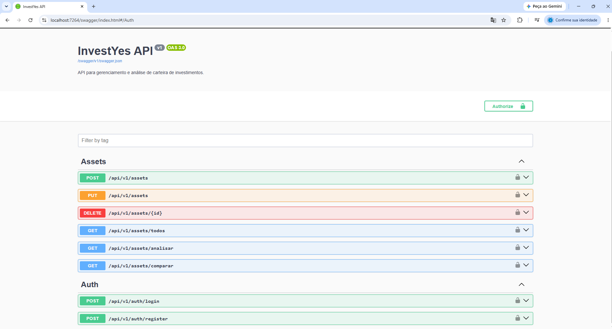
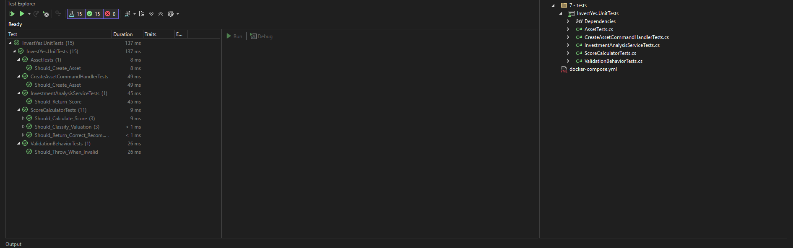

# 🚀 InvestYes

<div align="center">

# Plataforma Inteligente para Análise de Investimentos

### Desenvolvida com **.NET 9**, Clean Architecture, DDD, CQRS, Event-Driven Architecture, RabbitMQ, PostgreSQL e Docker.

Projeto desenvolvido com foco em **escalabilidade**, **boas práticas**, **arquitetura corporativa** e **alta disponibilidade**, simulando uma aplicação utilizada em ambientes de produção.

---


</div>

---

# 📖 Sobre o Projeto

O **InvestYes** é uma plataforma para análise inteligente de investimentos no mercado financeiro brasileiro.

O objetivo do projeto é demonstrar a construção de uma aplicação corporativa moderna utilizando os principais padrões arquiteturais adotados por empresas de tecnologia e instituições financeiras.

A aplicação centraliza informações provenientes de múltiplos provedores de mercado, consolida indicadores financeiros, calcula um score de qualidade para ativos e disponibiliza análises por meio de uma API REST documentada.

O projeto foi desenvolvido seguindo princípios de:

- Clean Architecture
- Domain-Driven Design (DDD)
- CQRS
- Event-Driven Architecture
- SOLID
- Repository Pattern
- Unit of Work
- Outbox Pattern
- Dependency Injection
- Test-Driven Development (TDD)

---

# 🎯 Objetivos

O InvestYes foi criado para resolver um problema comum de investidores: consultar informações de diferentes fontes e consolidar indicadores para tomada de decisão.

Atualmente a plataforma suporta:

- 🏢 Fundos Imobiliários (FIIs)
- 📈 Ações
- 💹 ETFs
- 🌎 BDRs
- 💰 Fundos de Investimento

Cada ativo pode ser analisado individualmente ou comparado com outros ativos utilizando indicadores financeiros e regras de negócio.

---

# ⭐ Principais Funcionalidades

## Cadastro de ativos

- Cadastro de novos ativos
- Alteração
- Exclusão
- Consulta
- Versionamento da API

---

## Análise Inteligente

A API realiza análises automáticas considerando indicadores como:

- P/VP
- VP/Cota
- Dividend Yield
- Patrimônio Líquido
- Liquidez Média
- Quantidade de Cotistas
- Rentabilidade Mensal
- Gestão Ativa

---

## Score Inteligente

Cada FII recebe automaticamente um score de investimento.

Exemplo:

| Indicador | Avaliação |
|-----------|-----------|
| P/VP | ⭐⭐⭐⭐⭐ |
| Dividend Yield | ⭐⭐⭐⭐⭐ |
| Liquidez | ⭐⭐⭐⭐ |
| Patrimônio | ⭐⭐⭐⭐ |
| Gestão | ⭐⭐⭐⭐ |

Resultado:

```text
Ticker

MXRF11

Score

91 / 100

Classificação

🟢 Barato
```

---

## Múltiplos Provedores

A aplicação utiliza um modelo de redundância para garantir maior disponibilidade das informações.

```text
                 CompositeMarketDataProvider

                          │

        ┌─────────────────┼─────────────────┐

        ▼                 ▼                 ▼

      BRAPI         Yahoo Finance      FundsExplorer

        │                 │                 │

        └─────────────────┼─────────────────┘

                          ▼

              Consolidação dos Indicadores
```

Caso um provedor esteja indisponível ou retorne erro (**HTTP 429**, timeout ou indisponibilidade), o sistema realiza automaticamente o fallback para outro provedor.

---

# 🏛 Arquitetura

O projeto foi desenvolvido utilizando uma arquitetura baseada em separação de responsabilidades.

```text
                     Clean Architecture

              ┌────────────────────────────┐
              │       Presentation         │
              │     InvestYes.API          │
              └─────────────┬──────────────┘
                            │
                      MediatR / CQRS
                            │
        ┌───────────────────┼────────────────────┐
        │                                        │
   Commands                                 Queries
        │                                        │
 Entity Framework Core                      Dapper
        │                                        │
        └───────────────────┬────────────────────┘
                            │
                      Domain Services
                            │
                    Repository Pattern
                            │
                       Unit Of Work
                            │
                       PostgreSQL
```

---

# 🧩 Arquitetura da Solução

```text
src

├── InvestYes.API
│
├── InvestYes.Application
│
├── InvestYes.Domain
│
├── InvestYes.Infrastructure
│
├── InvestYes.IoC
│
└── InvestYes.Worker

tests

└── InvestYes.UnitTests
```

---

# 🛠 Tecnologias Utilizadas

## Backend

- .NET 9
- ASP.NET Core 9
- C# 13
- MediatR
- AutoMapper
- FluentValidation

---

## Persistência

- PostgreSQL
- Entity Framework Core
- Dapper
- Unit Of Work

---

## Arquitetura

- Clean Architecture
- DDD
- CQRS
- SOLID
- Repository Pattern
- Dependency Injection
- Event-Driven Architecture
- Outbox Pattern

---

## Mensageria

- RabbitMQ

---

## Segurança

- JWT Authentication
- BCrypt
- Authorization Policies

---

## Observabilidade

- OpenTelemetry
- Serilog
- Seq

---

## Infraestrutura

- Docker
- Docker Compose

---

## Testes

- xUnit
- FluentAssertions
- Moq

---

# 💡 Diferenciais Técnicos

Este projeto demonstra conhecimentos práticos em tecnologias e padrões amplamente utilizados em aplicações corporativas:

- ✅ Clean Architecture
- ✅ Domain-Driven Design (DDD)
- ✅ CQRS com MediatR
- ✅ Entity Framework Core
- ✅ Dapper (Read Model)
- ✅ Unit of Work
- ✅ Repository Pattern
- ✅ RabbitMQ
- ✅ Event-Driven Architecture
- ✅ Outbox Pattern
- ✅ Background Workers
- ✅ JWT Authentication
- ✅ API Versioning
- ✅ Swagger / OpenAPI
- ✅ OpenTelemetry
- ✅ Serilog + Seq
- ✅ Docker Compose
- ✅ Testes Unitários (TDD)

---

# 📑 Índice

- Sobre o Projeto
- Arquitetura
- Tecnologias
- Deploy Docker
- Event-Driven + Outbox
- Swagger
- Segurança
- Observabilidade
- Background Workers
- Testes Unitários
- Cobertura de Testes
- Roadmap
- Contribuição
- Licença

---

> **➡️ Na Etapa 2 serão adicionados os diagramas completos (Deploy Docker, Event-Driven + Outbox, Background Worker, Swagger, JWT, RabbitMQ, Observabilidade e imagens do projeto).**

# 🐳 Deploy com Docker

Toda a infraestrutura da aplicação pode ser executada através do **Docker Compose**, permitindo iniciar todos os serviços com um único comando.

```bash
docker compose up -d
```

---

## Arquitetura de Deploy

```text
                           Docker Host

 ┌──────────────────────────────────────────────────────────────────────┐

          +-------------------------------+
          |        InvestYes.API          |
          |         ASP.NET Core          |
          +---------------+---------------+
                          |
          +---------------+---------------+
          |                               |
          ▼                               ▼

 +--------------------+         +----------------------+
 |    PostgreSQL      |         |      RabbitMQ        |
 |    Write / Read    |         | Exchanges / Queues   |
 +---------+----------+         +----------+-----------+
           ▲                                ▲
           |                                |
           |                                |
 +---------+----------+         +----------+-----------+
 |  InvestYes.Worker  |<--------| AssetCreated Events  |
 | Background Service |         +----------------------+
 +---------+----------+
           |
           ▼

 +----------------------+
 | OpenTelemetry OTLP   |
 +----------+-----------+
            |
            ▼

 +----------------------+
 |         Seq          |
 | Logs + Tracing       |
 +----------------------+

```

---

# 📦 Serviços Docker

| Serviço | Porta | Descrição |
|----------|------:|-----------|
| API | 8080 | API REST |
| PostgreSQL | 5432 | Banco de dados |
| RabbitMQ | 5672 | Mensageria |
| RabbitMQ Management | 15672 | Administração |
| Seq UI | 8081 | Visualização de Logs |
| Seq Ingestion | 5341 | Recebimento de Logs |

---

# 📡 Arquitetura Event-Driven

A aplicação utiliza comunicação assíncrona através do RabbitMQ.

Sempre que um ativo é criado, um evento é publicado.

```text

                HTTP Request

                      │

                      ▼

             CreateAssetCommand

                      │

                      ▼

           CreateAssetCommandHandler

                      │

          Repository.Add(Asset)

                      │

                      ▼

             UnitOfWork.Commit()

                      │

                      ▼

                PostgreSQL

                      │

                      ▼

             Outbox Message

                      │

                      ▼

             Background Worker

                      │

                      ▼

             RabbitMQ Exchange

                      │

                      ▼

                  Consumers

```

---

# 📨 Outbox Pattern

Para evitar inconsistências entre banco de dados e mensageria, o projeto implementa o **Outbox Pattern**.

Fluxo:

```text

Transaction

        │

        ▼

Persist Asset

        │

Persist Outbox Message

        │

Commit

        │

Background Worker

        │

Publish RabbitMQ

        │

Mark Outbox Processed

```

Benefícios:

- Garantia de entrega

- Evita perda de mensagens

- Consistência transacional

- Retry automático

- Alta disponibilidade

---

# 🐇 RabbitMQ

Eventos publicados:

| Evento | Descrição |
|---------|-----------|
| AssetCreatedEvent | Novo ativo cadastrado |
| AssetUpdatedEvent *(Roadmap)* | Atualização de ativo |
| AssetDeletedEvent *(Roadmap)* | Exclusão de ativo |

Exchange:

```text
investment.exchange
```

Routing Keys:

```text
asset.created

asset.updated

asset.deleted
```

---

# ⚙️ Background Workers

O projeto utiliza **Hosted Services** para processamento assíncrono.

Responsabilidades:

- Publicar mensagens do Outbox
- Consumir eventos
- Processar filas
- Retry automático
- Dead Letter Queue (Roadmap)

Fluxo:

```text

RabbitMQ

      │

      ▼

Worker

      │

Deserialize Event

      │

Execute Handler

      │

Persist Result

```

---

# 🔐 Segurança

A autenticação da API é baseada em **JWT (JSON Web Token)**.

Fluxo de autenticação:

```text

Register

      │

      ▼

BCrypt Password Hash

      │

      ▼

PostgreSQL

      │

      ▼

Login

      │

      ▼

JWT Token

      │

      ▼

Authorization Header

      │

      ▼

Protected Endpoints

```

---


---

## 🚀 Endpoints Públicos

|                                         Método                                         | Endpoint                | Descrição                     |
| :------------------------------------------------------------------------------------: | ----------------------- | ----------------------------- |
|  | `/api/v1/auth/register` | Cadastro de usuário           |
|  | `/api/v1/auth/login`    | Autenticação e geração do JWT |

---

## 🔒 Endpoints Protegidos

|                                           Método                                           | Endpoint                 | Descrição             |
| :----------------------------------------------------------------------------------------: | ------------------------ | --------------------- |
|      | `/api/v1/assets`         | Cadastra um ativo     |
|        | `/api/v1/assets`         | Atualiza um ativo     |
|  | `/api/v1/assets/{id}`    | Remove um ativo       |
|        | `/api/v1/assets`         | Lista todos os ativos |
|        | `/api/v1/assets/analyze` | Analisa um ativo      |
|        | `/api/v1/assets/compare` | Compara ativos        |

---


# 📚 Swagger / OpenAPI

A API possui documentação completa utilizando **Swagger/OpenAPI**.

Recursos disponíveis:

- Versionamento da API
- JWT Authentication
- OpenAPI 3
- Exemplos de Requests
- Exemplos de Responses

Adicionar a captura abaixo no repositório:

```text
docs/images/swagger.png
```

Depois inserir:

```markdown
## Swagger


```

---

# 📊 Observabilidade

A aplicação possui observabilidade ponta a ponta.

Componentes:

- OpenTelemetry
- Serilog
- Seq
- ActivitySource
- Distributed Tracing

Fluxo:

```text

API

 │

 ▼

ActivitySource

 │

 ▼

OpenTelemetry

 │

 ▼

OTLP Exporter

 │

 ▼

Seq

 │

 ▼

Dashboard

```

---

## Logs Estruturados

Todos os logs são estruturados utilizando Serilog.

Exemplo:

```json
{
  "Timestamp":"2026-07-16T10:32:45Z",
  "Level":"Information",
  "TraceId":"9d3fd5...",
  "RequestId":"98fd...",
  "Message":"Asset created successfully"
}
```

---

# 🌐 Integração com Provedores Externos

A plataforma utiliza múltiplos provedores para garantir alta disponibilidade.

```text

             CompositeMarketDataProvider

                        │

        ┌───────────────┼────────────────┐

        ▼               ▼                ▼

     BRAPI        Yahoo Finance     FundsExplorer

        │               │                │

        └───────────────┼────────────────┘

                        ▼

            Consolidação dos Indicadores

                        │

                        ▼

              InvestmentAnalysisService

```

### Estratégia de Fallback

Caso um provedor apresente:

- HTTP 429
- Timeout
- Falha de comunicação
- Dados inválidos

o sistema automaticamente consulta o próximo provedor disponível.

---

# 📈 Score dos FIIs

O sistema calcula automaticamente um score baseado em regras de negócio.

Critérios avaliados:

| Indicador | Peso |
|-----------|-----:|
| P/VP | ⭐⭐⭐⭐⭐ |
| Dividend Yield | ⭐⭐⭐⭐⭐ |
| VP/Cota | ⭐⭐⭐⭐ |
| Liquidez | ⭐⭐⭐⭐ |
| Patrimônio Líquido | ⭐⭐⭐ |
| Gestão | ⭐⭐⭐ |

Exemplo:

```text

Ticker

MXRF11

Preço

9,72

P/VP

0,90

VP/Cota

9,97

Dividend Yield

12,29%

Score

91/100

Classificação

🟢 BARATO

```

---

> **➡️ Na Etapa 3 serão adicionados: Testes Unitários, Cobertura de Testes (com a imagem do Test Explorer), imagem do Swagger, estrutura dos testes, exemplos de requisições da API, boas práticas, roadmap, contribuição, licença e seção "Sobre o Autor".**


# 🧪 Testes Unitários

O projeto foi desenvolvido seguindo os princípios de **Test-Driven Development (TDD)**, garantindo maior confiabilidade, facilidade de manutenção e evolução contínua do código.

As regras de negócio críticas são cobertas por testes automatizados utilizando **xUnit**, **Moq** e **FluentAssertions**.

---

## Tecnologias

- xUnit
- Moq
- FluentAssertions
- AutoFixture *(Roadmap)*

---

## Estrutura dos Testes

```text
tests

└── InvestYes.UnitTests

    ├── Authentication
    │
    ├── Commands
    │
    ├── Domain
    │
    ├── Repositories
    │
    ├── Services
    │
    ├── Validators
    │
    └── ScoreCalculator
```

---

## Cobertura

Atualmente o projeto possui testes para:

| Camada | Status |
|---------|:------:|
| Domain | ✅ |
| Commands | ✅ |
| Authentication | ✅ |
| JWT | ✅ |
| Validators | ✅ |
| Repository | ✅ |
| Unit Of Work | ✅ |
| Score Calculator | ✅ |
| InvestmentAnalysisService | ✅ |

---

## Executando os testes

```bash
dotnet test
```

---

## Resultado

Adicionar a captura abaixo:

```text
docs/images/test-explorer.png
```

Depois inserir:

```markdown
## Resultado da Execução



```

---

# 📚 Swagger

A API possui documentação completa utilizando **Swagger/OpenAPI**.

Recursos disponíveis:

- Versionamento da API
- OpenAPI 3
- JWT Authentication
- Teste dos endpoints diretamente pelo navegador
- Exemplos de Requests
- Exemplos de Responses

---

Adicionar a captura abaixo:

```text
docs/images/swagger.png
```

Depois inserir:

```markdown
## Swagger


```

---

# 📡 Endpoints Disponíveis

## Authentication

| Método | Endpoint |
|---------|----------|
| POST | /api/v1/auth/register |
| POST | /api/v1/auth/login |

---

## Assets

| Método | Endpoint |
|---------|----------|
| POST | /api/v1/assets |
| PUT | /api/v1/assets |
| DELETE | /api/v1/assets/{id} |
| GET | /api/v1/assets |
| GET | /api/v1/assets/analyze |
| GET | /api/v1/assets/compare |

---

# 📥 Exemplo de Login

Request

```http
POST /api/v1/auth/login
```

```json
{
  "email":"admin@investyes.com",
  "password":"123456"
}
```

Response

```json
{
  "accessToken":"eyJhbGciOiJIUzI1NiIs...",
  "expiresIn":3600
}
```

---

# 📈 Exemplo de Análise

Request

```http
GET /api/v1/assets/analyze?symbol=MXRF11
```

Response

```json
{
  "ticker":"MXRF11",
  "price":9.72,
  "dividendYield":12.29,
  "pVp":0.90,
  "vpCota":9.97,
  "score":91,
  "classification":"Barato",
  "provider":"FundsExplorer"
}
```

---

# 💎 Boas Práticas Utilizadas

✔ Clean Architecture

✔ Domain-Driven Design (DDD)

✔ CQRS

✔ SOLID

✔ Repository Pattern

✔ Unit Of Work

✔ Dapper (Read Model)

✔ Entity Framework Core (Write Model)

✔ Event-Driven Architecture

✔ RabbitMQ

✔ Outbox Pattern

✔ Dependency Injection

✔ JWT Authentication

✔ BCrypt

✔ Versionamento da API

✔ Swagger / OpenAPI

✔ OpenTelemetry

✔ Serilog

✔ Seq

✔ Background Workers

✔ Docker Compose

✔ Health Checks

✔ Testes Unitários

✔ TDD

---

# 🚀 Roadmap

Próximas evoluções planejadas:

- Cache distribuído com Redis
- SignalR para cotações em tempo real
- Dashboard Web em Blazor
- API Gateway com YARP
- Kubernetes
- Azure Kubernetes Service (AKS)
- CI/CD com Azure DevOps
- GitHub Actions
- Prometheus + Grafana
- Integração com IA para análise de investimentos
- Microsserviços independentes

---

# 📊 Resumo da Arquitetura

| Camada | Tecnologia |
|---------|------------|
| API | ASP.NET Core 9 |
| Aplicação | MediatR + CQRS |
| Domínio | DDD |
| Persistência | EF Core + Dapper |
| Banco | PostgreSQL |
| Mensageria | RabbitMQ |
| Worker | BackgroundService |
| Segurança | JWT |
| Logs | Serilog |
| Observabilidade | OpenTelemetry |
| Dashboard | Seq |
| Testes | xUnit |

---

# 🤝 Contribuindo

Contribuições são sempre bem-vindas.

1. Faça um Fork

2. Crie uma Branch

```bash
git checkout -b feature/minha-feature
```

3. Commit

```bash
git commit -m "Nova funcionalidade"
```

4. Push

```bash
git push origin feature/minha-feature
```

5. Abra um Pull Request

---

# 📄 Licença

Este projeto está licenciado sob a **MIT License**.

---

# 👨‍💻 Sobre o Autor

## João Paulo

**Senior .NET Developer**

Especialista em desenvolvimento de aplicações corporativas utilizando tecnologias Microsoft.

### Principais competências

- .NET 9
- C#
- ASP.NET Core
- Clean Architecture
- Domain-Driven Design (DDD)
- CQRS
- MediatR
- Entity Framework Core
- Dapper
- PostgreSQL
- RabbitMQ
- Docker
- OpenTelemetry
- Serilog
- Azure DevOps
- Microsserviços
- Event-Driven Architecture

---

# ⭐ Considerações Finais

O **InvestYes** foi desenvolvido para demonstrar a aplicação de padrões arquiteturais modernos utilizados em sistemas corporativos de alta escalabilidade.

Além de disponibilizar funcionalidades de análise de investimentos, o projeto evidencia conhecimentos em arquitetura de software, mensageria, observabilidade, segurança, persistência híbrida, testes automatizados e integração com provedores externos.

Este repositório representa uma implementação prática de conceitos amplamente utilizados em ambientes de produção e pode servir como referência para estudos, evolução técnica e demonstração de competências em processos seletivos para posições de **Desenvolvedor .NET Sênior**, **Tech Lead** ou **Arquiteto de Software**.

---

<div align="center">

### ⭐ Se este projeto foi útil, considere deixar uma estrela no repositório!

**Obrigado pela visita!**

</div>
